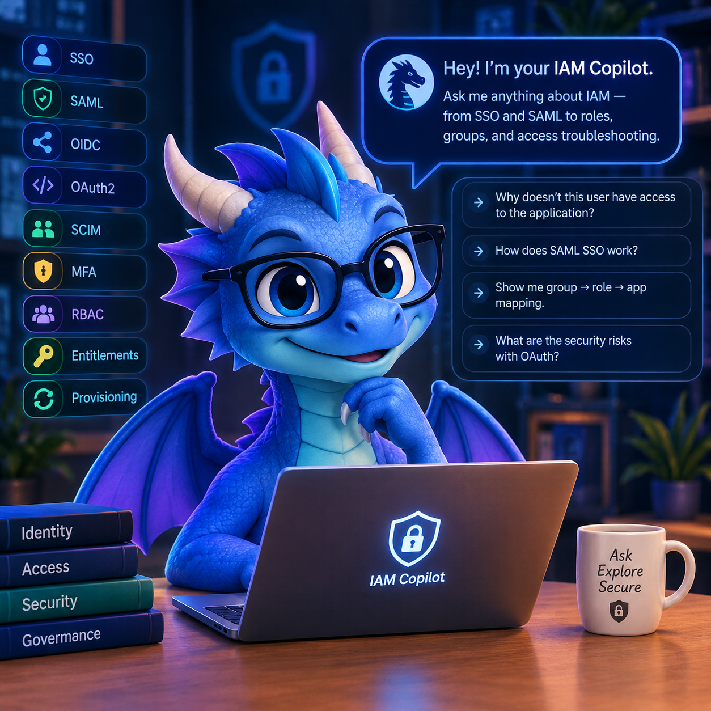

# IAM Copilot

<p align="center">
  
</p>

A local, single-page knowledge hub for Okta and enterprise Identity & Access
Management concepts — a searchable catalog of 27 IAM/Okta capabilities with
protocols, agents, use cases, security notes, a personal learning tracker,
a persistent daily activity log, and an AI copilot chat (Google Gemini)
grounded in the catalog.

**Stack: Python (Flask + Jinja2 + vanilla JS), not Next.js.** See
[docs/2026-09-09-python-rewrite.md](./docs/2026-09-09-python-rewrite.md) for
why and what changed; the app's features and behavior are unchanged from the
prior TypeScript version.

## Quick start

```bash
pip install -r requirements.txt
python seed.py
python app.py
```

Open **http://localhost:3000**.

The catalog, search, status tracking, and activity log work with no extra
setup. The **Copilot** tab calls the Gemini API server-side and needs
`GEMINI_API_KEY` in `.env` (`GEMINI_MODEL` optional, defaults to
`gemini-3.6-flash`). Requires Python ≥ 3.9; verified on Python 3.11.

See **[CLAUDE.md](./CLAUDE.md)** for the full project overview, architecture
summary, environment variables, folder structure, and known limitations. The
decision logs in **[docs/](./docs/)** cover the reasoning behind each build:
[2026-09-06 initial build](./docs/2026-09-06-initial-build.md),
[2026-09-08 Node 24 fix + Gemini copilot](./docs/2026-09-08-gemini-copilot.md),
and [2026-09-09 Python rewrite](./docs/2026-09-09-python-rewrite.md).
